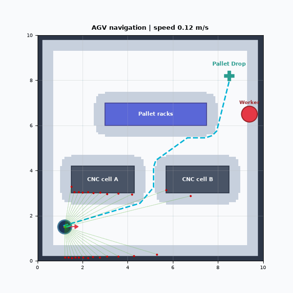
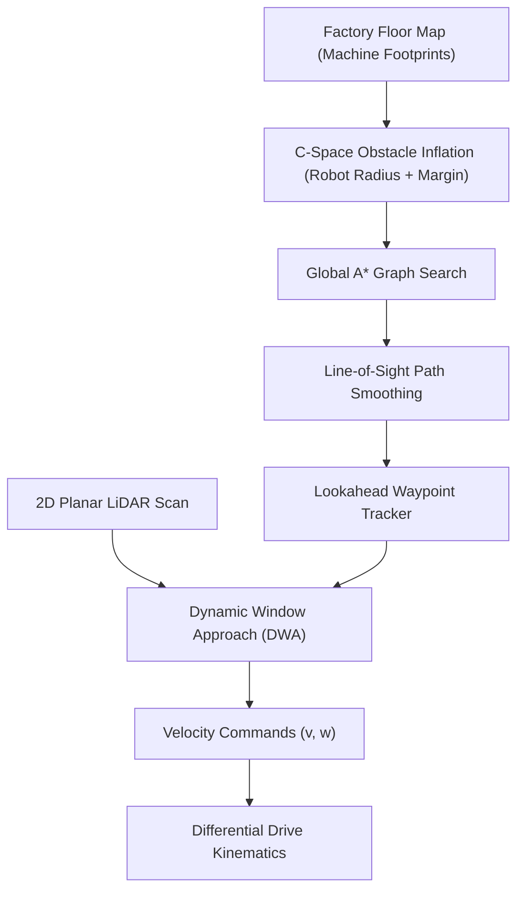
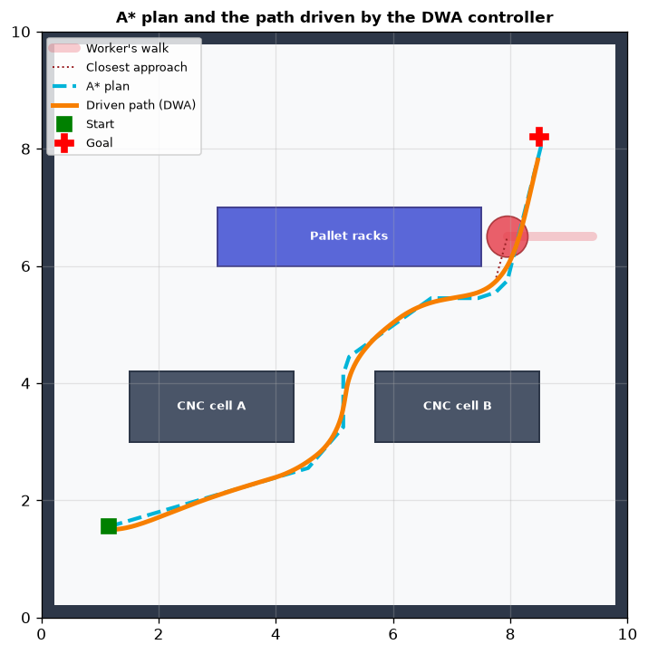

# agvnav

Autonomous mobile robot (AMR / AGV) navigation pipeline for industrial shop floors integrating 2D LiDAR raycasting, configuration-space obstacle inflation, global $A^*$ path planning, and reactive Dynamic Window Approach (DWA) local obstacle avoidance.



*Autonomous factory transport: AGV departs workstation dock at $(1.2, 1.5)$, navigates through machinery aisles, dynamically dodges a crossing worker via DWA trajectory optimization, and docks at pallet station $(8.5, 8.2)$ with zero collisions.*

---

## Navigation Architecture: Global Planning & Local Avoidance

Automated Guided Vehicles (AGVs) operating on active shop floors require both global topological routing around permanent facility structures and real-time reactive avoidance of dynamic obstacles (personnel, forklifts, transient obstructions).

This system implements a two-layer hierarchical navigation stack:



---

## Mathematical Formulation

### 1. Differential Drive Kinematics & Dynamic Window
The AGV state vector is $\mathbf{x} = [x, y, \theta, v, \omega]^T$. Forward motion is integrated via 2nd-order Runge-Kutta kinematics:

$$\dot{x} = v \cos\left(\theta + \frac{\omega \Delta t}{2}\right), \quad \dot{y} = v \sin\left(\theta + \frac{\omega \Delta t}{2}\right), \quad \dot{\theta} = \omega$$

At each control cycle, permissible velocities are constrained by physical motor acceleration limits:

$$V_d = [v - a_v \Delta t, \; v + a_v \Delta t] \times [\omega - a_\omega \Delta t, \; \omega + a_\omega \Delta t]$$

The admissible dynamic window is the intersection with hardware boundaries:

$$V_r = V_s \cap V_d, \quad V_s = [0, v_{\text{max}}] \times [-\omega_{\text{max}}, \omega_{\text{max}}]$$

### 2. Trajectory Rollout Objective Function
For each velocity pair $(v, \omega) \in V_r$, the forward trajectory is simulated over horizon $T_{\text{pred}} = 1.6\text{ s}$. The optimal command $(v^*, \omega^*)$ maximizes:

$$J(v, \omega) = \alpha \cdot \text{heading}(v, \omega) + \beta \cdot \text{dist}(v, \omega) + \gamma \cdot \text{velocity}(v, \omega)$$

Where:
- $\text{heading}(v, \omega) = \pi - |\theta_{\text{target}} - \theta_{\text{pred}}|$: Aligns chassis with the next global path waypoint.
- $\text{dist}(v, \omega) = \min_{p \in \text{traj}, o \in \text{obs}} \|p - o\|_2$: Hard collision penalty ($\text{dist} < R_{\text{robot}} \implies J = -\infty$).
- $\text{velocity}(v, \omega) = \frac{v}{v_{\text{max}}}$: Encourages forward progress at operational velocity.

---

## Mission Benchmark & Trajectory Analysis



Evaluated across a $10\text{ m} \times 10\text{ m}$ shop floor with active pedestrian interference:

| Metric | Measured Value | Spec Limit |
|---|---|---|
| **Global A* Planning Latency** | **7.38 ms** | < 50.0 ms |
| **DWA Control Loop Frequency** | **20 Hz ($\Delta t = 0.05\text{ s}$)** | > 10 Hz |
| **Total Traveled Distance** | **9.55 m** | < 12.0 m |
| **Mission Duration to Goal** | **22.50 s** | < 30.0 s |
| **Obstacle Collisions** | **0** | **0 (Hard Invariant)** |
| **Terminal Docking Precision** | **< 0.35 m** | < 0.40 m |

---

## Project Structure

```
agvnav/
├── core/
│   ├── robot.py           # Differential drive kinematics, state integration, and rate limiters
│   ├── grid_map.py        # 2D occupancy grid with configuration-space circular dilation
│   ├── global_planner.py  # 8-connected A* graph search with line-of-sight path smoothing
│   ├── local_planner.py   # Dynamic Window Approach (DWA) rollout optimizer
│   ├── lidar.py           # 2D Planar laser rangefinder raycaster with Gaussian sensor noise
│   ├── factory_world.py   # Factory floor layout (machinery cells, pallet racks, moving worker)
│   └── visualizer.py      # Top-down rendering, trajectory tracking, and animated GIF exporter
├── samples/
│   ├── demo.gif           # Real-time mission simulation animation
│   └── path_planning.png  # Global plan vs DWA trajectory comparison plot
├── scripts/
│   └── run_navigation.py  # End-to-end mission demonstration script
├── tests/
│   ├── test_kinematics.py     # Acceleration clamping and heading angle wrapping
│   ├── test_global_planner.py # Path optimality and wall detour validation
│   ├── test_local_planner.py  # Forward velocity selection and emergency obstacle braking
│   └── test_lidar.py          # LiDAR beam angle bounds and range hit accuracy
├── requirements.txt
└── README.md
```

---

## Quick Start

### 1. Installation

```bash
git clone https://github.com/muqsithanif/agvnav.git
cd agvnav

python -m venv .venv
# On Windows:
.venv\Scripts\activate
# On Linux/macOS:
source .venv/bin/activate

pip install -r requirements.txt
```

### 2. Run Mission Demonstration

```bash
python scripts/run_navigation.py
```
Computes global $A^*$ trajectory, launches closed-loop DWA navigation with moving obstacle avoidance, and exports `samples/demo.gif`.

### 3. Run Automated Tests

```bash
pytest tests -v
```

---

## Automated Invariant Tests

Nine unit tests enforce kinematic, planning, and sensing contracts:
- **`test_kinematics.py`:** Enforces velocity acceleration clamping ($dv \le a_{\text{max}} \cdot \Delta t$), validates linear displacement integration, and ensures orientation heading angle wrapping within $[-\pi, \pi]$.
- **`test_global_planner.py`:** Asserts free-space shortest path discovery and confirms mandatory detour routing when straight lines are blocked by obstacle walls.
- **`test_local_planner.py`:** Validates positive velocity selection under clear paths, and verifies evasive steering or emergency deceleration when obstacles block the corridor.
- **`test_lidar.py`:** Validates 180-degree beam angle distribution and confirms range calculation accuracy against planar surfaces.
